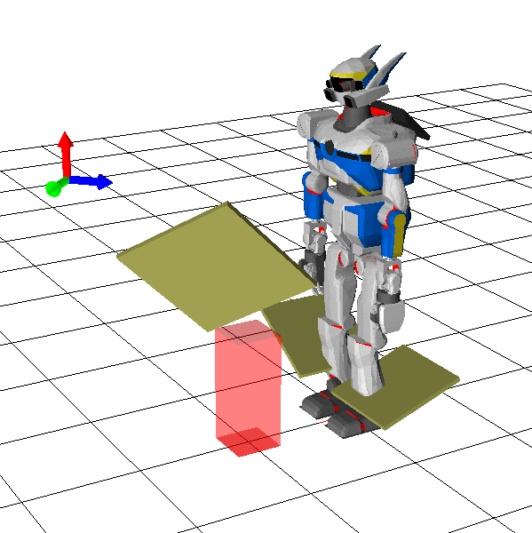
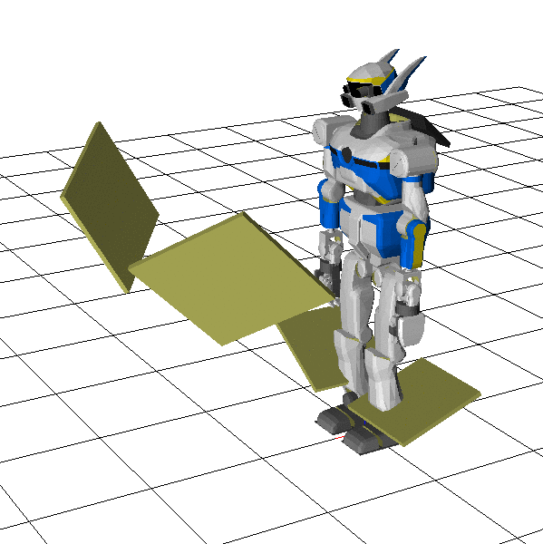
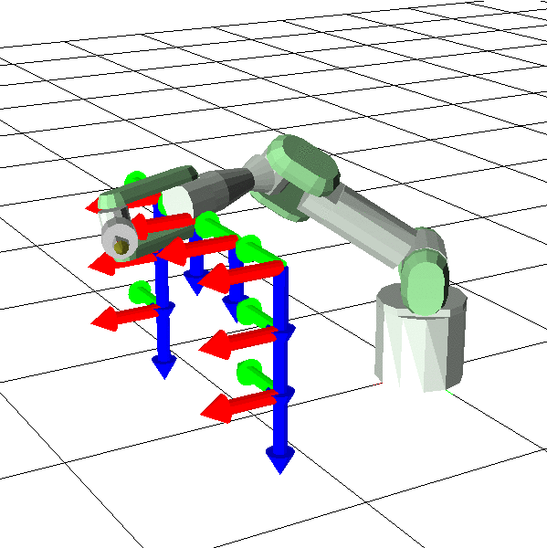

# optmotiongen (Optimization Motion Generation)

Robot motion generation based on sequential quadratic programming (SQP) optimization.

The advantage over conventional inverse kinematics is,
1. possible to generate a trajectory of posture.
2. possible to consider not only kinematics constraints but also statics constraints.

Please use [mmurooka/optmotiongen-experimental](https://github.com/mmurooka/jsk_control/tree/optmotiongen-experimental/eus_qp/optmotiongen) branch when trying latest version.


## Manual

[manual.pdf](./manual/manual.pdf)
(Generated from euslisp source code.)


<!--
Paste the output of generate-gif.l from here
-->
## Sample (irteus sample robot)

Gif images are generated by [generate-gif.l](doc/generate-gif.l). Gif animation is not realtime (actually it is slower than gif animation).

### inverse-kinematics-optmotiongen

[sample-inverse-kinematics.l](./euslisp/sample/sample-inverse-kinematics.l)

###### sample-arm-reach-ik-raw
```
(sample-arm-reach-ik-raw)
```


###### sample-arm-reach-ik-raw-msc
```
(sample-arm-reach-ik-raw-msc)
```


###### sample-arm-reach-ik
```
(sample-arm-reach-ik)
```


###### sample-arm-reach-ik-obstacle
```
(sample-arm-reach-ik-obstacle)
```


###### sample-arm-reach-ik-posture
```
(sample-arm-reach-ik-posture)
```


###### sample-arm-reach-ik-with-root-virtual-joint
```
(sample-arm-reach-ik-with-root-virtual-joint)
```


###### sample-arm-reach-ik-face
```
(sample-arm-reach-ik-face)
```


###### sample-arm-reach-ik-line
```
(sample-arm-reach-ik-line)
```


###### sample-robot-reach-ik-raw
```
(sample-robot-reach-ik-raw)
```


###### sample-robot-reach-ik-raw-with-set-posture-look-at
```
(sample-robot-reach-ik-raw :set-posture-joint? t :look-at? t)
```


###### sample-robot-reach-ik
```
(sample-robot-reach-ik)
```


###### sample-robot-reach-ik-limb
```
(sample-robot-reach-ik-limb)
```


###### sample-robot-reach-ik-dual-arm
```
(sample-robot-reach-ik-dual-arm)
```


###### sample-robot-reach-ik-dual-arm-with-torso
```
(sample-robot-reach-ik-dual-arm-with-torso)
```


###### sample-robot-reach-ik-fullbody
```
(sample-robot-reach-ik-fullbody)
```


### inverse-kinematics-trajectory-optmotiongen

[sample-inverse-kinematics.l](./euslisp/sample/sample-inverse-kinematics.l)

###### sample-arm-reach-trajectory-ik-raw
```
(sample-arm-reach-trajectory-ik-raw)
```


###### sample-arm-reach-trajectory-ik
```
(sample-arm-reach-trajectory-ik)
```


###### sample-arm-reach-trajectory-ik-with-root-virtual-joint
```
(sample-arm-reach-trajectory-ik-with-root-virtual-joint)
```


###### sample-arm-reach-trajectory-ik-with-root-virtual-joint-obstacle
```
(sample-arm-reach-trajectory-ik-with-root-virtual-joint-obstacle)
```


###### sample-robot-reach-trajectory-ik-dual-arm-with-torso
```
(sample-robot-reach-trajectory-ik-dual-arm-with-torso)
```


###### sample-robot-reach-trajectory-ik-dual-arm-with-torso-no-mid-constraint
```
(sample-robot-reach-trajectory-ik-dual-arm-with-torso-no-mid-constraint)
```


###### sample-robot-reach-trajectory-ik-fullbody
```
(sample-robot-reach-trajectory-ik-fullbody)
```


### inverse-kinematics-statics-optmotiongen

[sample-inverse-kinematics-statics.l](./euslisp/sample/sample-inverse-kinematics-statics.l)

###### sample-robot-reach-iks-raw
```
(sample-robot-reach-iks-raw)
```


###### sample-robot-reach-iks-without-torque
```
(sample-robot-reach-iks :optimize-torque? nil)
```


###### sample-robot-reach-iks
```
(sample-robot-reach-iks :optimize-torque? t)
```


###### sample-robot-reach-iks-face-without-torque
```
(sample-robot-reach-iks-face :optimize-torque? nil)
```


###### sample-robot-reach-iks-face
```
(sample-robot-reach-iks-face :optimize-torque? t)
```


### inverse-kinematics-statics-trajectory-optmotiongen

[sample-inverse-kinematics-statics.l](./euslisp/sample/sample-inverse-kinematics-statics.l)

###### sample-robot-reach-trajectory-iks-raw
```
(sample-robot-reach-trajectory-iks-raw)
```


###### sample-robot-reach-trajectory-iks-without-torque
```
(sample-robot-reach-trajectory-iks :optimize-start-end-torque? nil)
```


###### sample-robot-reach-trajectory-iks
```
(sample-robot-reach-trajectory-iks :optimize-start-end-torque? t)
```


###### sample-robot-reach-trajectory-iks-face-without-torque
```
(sample-robot-reach-trajectory-iks-face :optimize-start-end-torque? nil)
```


###### sample-robot-reach-trajectory-iks-face
```
(sample-robot-reach-trajectory-iks-face :optimize-start-end-torque? t)
```


### sample-robot-sqp-instant-manip-config-task

[sample-samplerobot.l](./euslisp/sample/sample-samplerobot.l)

###### sample-robot-sqp-instant-manip-config-task-without-torque
```
(sample-robot-sqp-instant-manip-config-task :fix-obj? nil :optimize-torque? nil)
```


###### sample-robot-sqp-instant-manip-config-task-fix-obj-without-torque
```
(sample-robot-sqp-instant-manip-config-task :fix-obj? t :optimize-torque? nil)
```


###### sample-robot-sqp-instant-manip-config-task
```
(sample-robot-sqp-instant-manip-config-task :fix-obj? nil :optimize-torque? t)
```


###### sample-robot-sqp-instant-manip-config-task-fix-obj
```
(sample-robot-sqp-instant-manip-config-task :fix-obj? t :optimize-torque? t)
```


### sample-arm-sqp-bspline-config-task

[sample-samplerobot.l](./euslisp/sample/sample-samplerobot.l)

###### sample-arm-sqp-bspline-config-task
```
(sample-arm-sqp-bspline-config-task)
```


### sample-robot-sqp-bspline-dynamic-config-task

[sample-samplerobot.l](./euslisp/sample/sample-samplerobot.l)

###### sample-robot-sqp-bspline-dynamic-config-task
```
(sample-robot-sqp-bspline-dynamic-config-task)
```


## Sample (HRP2)

### instant-configuration-task

[sample-sqp-optimization-instant.l](./euslisp/sample/sample-sqp-optimization-instant.l)

###### sample-sqp-optimization-instant
```
(sample-sqp-optimization-instant :optimize-torque? t)
```


###### sample-sqp-optimization-instant-without-torque
```
(sample-sqp-optimization-instant :optimize-torque? nil)
```


###### sample-sqp-optimization-instant-only-kinematics
```
(sample-sqp-optimization-instant :only-kinematics? t)
```


### trajectory-configuration-task

[sample-sqp-optimization-trajectory.l](./euslisp/sample/sample-sqp-optimization-trajectory.l)

###### sample-sqp-optimization-trajectory
```
(sample-sqp-optimization-trajectory :optimize-start-end-torque? t)
```


###### sample-sqp-optimization-trajectory-without-torque
```
(sample-sqp-optimization-trajectory :optimize-start-end-torque? nil)
```


### instant-manip-configuration-task

[sample-sqp-optimization-instant-manip.l](./euslisp/sample/sample-sqp-optimization-instant-manip.l)

###### sample-sqp-optimization-instant-manip
```
(sample-sqp-optimization-instant-manip :optimize-torque? t)
```


###### sample-sqp-optimization-instant-manip-without-torque
```
(sample-sqp-optimization-instant-manip :optimize-torque? nil)
```


### trajectory-manip-configuration-task

[sample-sqp-optimization-trajectory-manip.l](./euslisp/sample/sample-sqp-optimization-trajectory-manip.l)

###### sample-sqp-optimization-trajectory-manip
```
(sample-sqp-optimization-trajectory-manip :optimize-start-end-torque? t)
```


###### sample-sqp-optimization-trajectory-manip-without-torque
```
(sample-sqp-optimization-trajectory-manip :optimize-start-end-torque? nil)
```


### bspline-configuration-task

[sample-sqp-optimization-bspline.l](./euslisp/sample/sample-sqp-optimization-bspline.l)

[graph of joint trajectory](./logs/sample-sqp-optimization-bspline.pdf)

###### sample-sqp-optimization-bspline
```
(sample-sqp-optimization-bspline)
```


### instant-configuration-task with sqp-msc

[sample-sqp-msc-optimization-instant.l](./euslisp/sample/sample-sqp-msc-optimization-instant.l)

###### sample-sqp-msc-optimization-instant-without-torque
```
(sample-sqp-msc-optimization-instant :optimize-torque? nil)
```


###### sample-sqp-msc-optimization-instant-only-kinematics
```
(sample-sqp-msc-optimization-instant :only-kinematics? t)
```


### sample-sqp-optimization-bspline-dynamic

[sample-sqp-optimization-bspline-dynamic.l](./euslisp/sample/sample-sqp-optimization-bspline-dynamic.l)

###### sample-sqp-optimization-bspline-dynamic
```
(sample-sqp-optimization-bspline-dynamic)
```


## Demo

### demo-hrp2jsknts-desk-reach-instant

[demo-hrp2jsknts-desk-reach-instant.l](./euslisp/demo/demo-hrp2jsknts-desk-reach-instant.l)

###### demo-hrp2jsknts-desk-reach-instant
```
(demo-hrp2jsknts-desk-reach-instant :use-thumb-contact? t :optimize-torque? t)
```


###### demo-hrp2jsknts-desk-reach-instant-without-torque
```
(demo-hrp2jsknts-desk-reach-instant :use-thumb-contact? t :optimize-torque? nil)
```


### demo-hrp2jsknts-desk-reach-trajectory

[demo-hrp2jsknts-desk-reach-trajectory.l](./euslisp/demo/demo-hrp2jsknts-desk-reach-trajectory.l)

###### demo-hrp2jsknts-desk-reach-trajectory
```
(demo-hrp2jsknts-desk-reach-trajectory :use-thumb-contact? t :optimize-torque-only-key-pose? t)
```


###### demo-hrp2jsknts-desk-reach-trajectory-without-torque
```
(demo-hrp2jsknts-desk-reach-trajectory :use-thumb-contact? t :optimize-torque-only-key-pose? nil)
```


### demo-pr2-regrasp-object

[demo-pr2-regrasp-object.l](./euslisp/demo/demo-pr2-regrasp-object.l)

###### demo-pr2-regrasp-object
```
(demo-pr2-regrasp-object)
```


### demo-fetch-elbow-stretch

[demo-fetch-elbow-stretch.l](./euslisp/demo/demo-fetch-elbow-stretch.l)

###### demo-fetch-elbow-stretch-with-stretch
```
(demo-fetch-elbow-stretch)
```


###### demo-fetch-elbow-stretch-without-stretch
```
(demo-fetch-elbow-stretch :stretch-elbow nil)
```


### demo-2d-body-trajectory

[demo-2d-body-trajectory.l](./euslisp/demo/demo-2d-body-trajectory.l)

###### demo-2d-body-trajectory-with-msc
```
(demo-2d-body-trajectory :num-of-solution-candidates 4)
```


###### demo-2d-body-trajectory-without-msc
```
(demo-2d-body-trajectory :num-of-solution-candidates 1)
```

