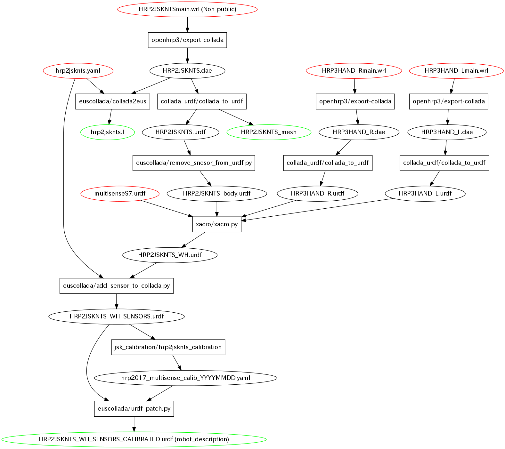

# hrp2jsknts_calibration

## How to hand/eye calibrate
### 1. Setup
0. Compile `hrpsys_ros_bridge_tutorials` with HRP2JSKNTS model (The model is not public).
```
$ catkin build hrpsys_ros_bridge_tutorials
```
0. You may have to change frame_id or other sensor related codes hard coded in system.yaml, cam_config.yaml, free_arms.yaml, free_cb_locations.yaml, system.yaml
1. Before calibrate hand/eye, Please confirm that your intrinsic parameter is calibrated.

### 2. Capture data
1. run `capture_data.launch` (You may have to set camera_ns to your camera ns)
```
$ roscd jsk_calibration/hrp2jsknts_calibration/capture_data
$ roslaunch capture_data.launch
```

1. Robot moves LEFT arm. Please attach checker board to its left hand.
2. Press enter to run capturing
3. After a while robot moves RIGHT arm. Please attach checker board to right hand.
4. Press enter to run capturing
5. After a while, capturing will be done. Please Ctrl-C to the terminal
you run `capture_data.launch`
6. Captured data is stored in `/tmp/hrp2jsknts_calibration`. Be careful about rebooting.

### 3. Estimate parameter
1. If you have some samples failed to capture data, please remove line from initial_poses.yaml
2. Check `spacing_x:` and `spacing_y:` values of `checkerboards:` in `estimate_params/config/system.yaml`. Please edit these values to be measurement values for actual checkerboard.
3. start roscore

  ```
$ rossetlocal
$ roscore
```
4. run `calibrate_hrp2jsknts.sh`.

  ```
$ rosssetlocal
$ ./calibrate_hrp2jsknts.sh
```
5. After a while (1 hour), you will get calibrated urdf file. The name of urdf file is
`robot_calibrated_YYYY_MM_DD_HH_SS.xml`.
Uncalibrated urdf file is `robot_uncalibrated_YYYY_MM_DD_HH_SS.xml`.

### 4. Check estimated parameter
1. kill `/hrpsys_state_publisher`

  ```
$ rosnode kill /hrpsys_state_publisher
```
2. update `/robot_description`

  ```
$ rosparam set robot_description -t robot_calibrated_YYYY_MM_DD_HH_SS.xml
```
3. run `robot_state_publisher`

  ```
$ rosrun robot_state_publisher robot_state_publisher
```
4. Check result in your rviz. If you do not satisfy with the result, Please go back to
section 3 or section 2.

### 5. Commit your calibrated parameter
HRP2 model is not public and we need to treat it carefully. So we don't manage the
calibrated urdf file directly.
We manage **diff between original urdf and calibrated urdf**.
And also the diff file is managed under private repository.

1. Compute diff using `urdf_patch.py`

  ```
$ roscd jsk_hrp2_ros_bridge/calib_data
$ rosrun euscollada urdf_patch.py diff `rospack find hrpsys_ros_bridge_tutorials`/models/HRP2JSKNTS_WH_SENSORS.urdf YOUR_CALIBDATED_FILE hrp2017_multisense_calib_YYYYMMDD.yaml
```
2. Update `hrp2017.launch` file to use the patch.

  ```xml
  <arg name="CALIB_FILE" default="hrp2017_multisense_calib_YYYYMMDD.yaml" />
```
3. Commit patch

  ```
$ git checkout -b update-calib
$ git add calib_data/hrp2017_multisense_calib_YYYYMMDD.yaml launch/hrp2017.launch
$ git commit -m "update HRP2 calibration file" calib_data/hrp2017_multisense_calib_YYYYMMDD.yaml launch/hrp2017.launch
$ git push YOUR_REMOTE update-calib
```

## Appendix
Pipeline of model conversion.


