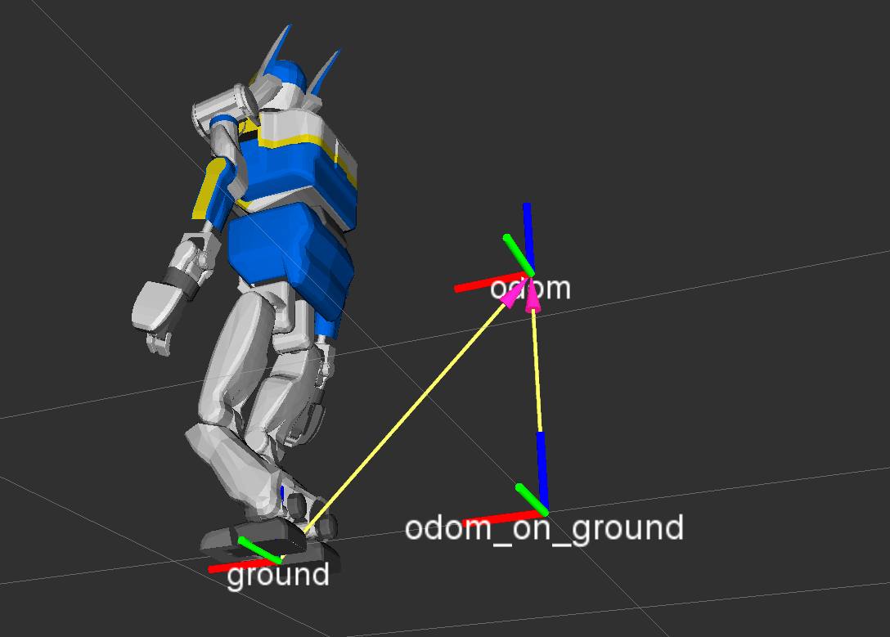
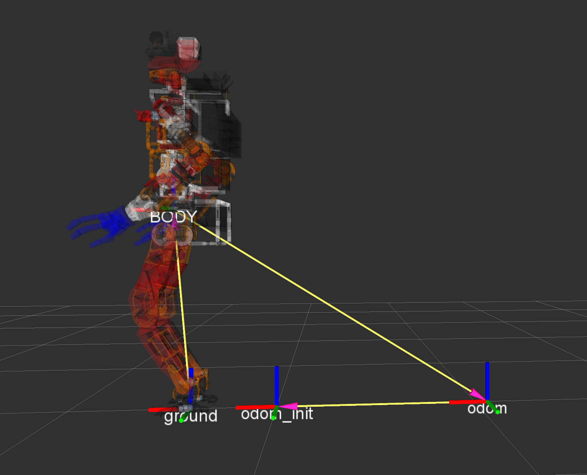

# jsk\_footstep\_controller

## footcoords

footcoords publishes three tf frames usefule for biped robots.
* `/ground`: the middle coordinate of two legs. Two legs are specified
by `~lleg_end_coords` and `~rleg_end_coords`.
* `/odom_on_ground`: The coordinate computing by projecting `/odom` on the plane which is defined by `/ground` frame. The transformation is updated only if the robot on the floow by checking
both of `lfsensor` and `rfsensor` provides enough force (the threshold is `~force_threshold`).
* `/odom_init`: The coordinate of `/odom` when the robot lands on the ground most recent.

### Subscribing Topics
* `lfsensosor` (`geometry_msgs/WrenchStamped`)
* `rfsensosor` (`geometry_msgs/WrenchStamped`)

   footcoords computes transformation only if these two topic get the
   same timestamp.

#### Publishing Topics
* `/tf` (`tf2_msgs/TFMessage`)
* `~state` (`std_msgs/String`):

   State of the robot and it is one of "air", "ground", "lfoot" and "rfoot".

#### Parameters
* `~output_frame_id` (String, default: `odom_on_ground`)
* `~parent_frame_id` (String, default: `odom`)
* `~midcoords_frame_id` (String, default: `ground`)

   Specifying frame\_ids. See above description about these frame\_ids.
* `~lfoot_frame_id` (String, default: `lleg_end_coords`)
* `~rfoot_frame_id` (String, default: `rleg_end_coords`)

   frame\_ids of end effectors of two legs.
* `~force_threshold` (Double, default: `10.0`)

   Force threshold to judge which leg is on the ground

* `~lfoot_sensor_frame` (String, default: `lleg_end_coords`)
* `~rfoot_sensor_frame` (String, default: `lleg_end_coords`)

   Transform force sensor rotation respected to these frame ids when evaluating force value.
   You need to choose reasonable frame_ids which gives positive z-force value when robot stands.

* `~invert_odom_init` (Bool, default: `true`)
   Broadcast tf of odom_init as parent of odom if `~invert_odom_init` is true (odom_init -> odom).
