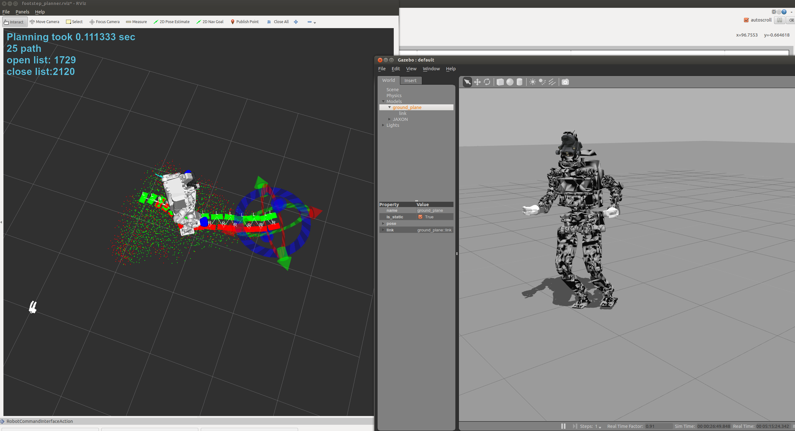

jsk_footstep_planner
=====================

## Use with simulator (gazebo + hrpsys)

* `roslaunch hrpsys_gazebo_tutorials gazebo_jaxon_no_controllers.launch`
* `rtmlaunch hrpsys_gazebo_tutorials jaxon_hrpsys_bringup.launch KINEMATICS_MODE:=true`
* `roslaunch jsk_footstep_planner optimistic_footstep_planner.launch USE_SIMPLE_FOOTSTEP_CONTROLLER:=true GLOBAL_FRAME:=odom USE_PERCEPTION:=false ROBOT:=JAXON_RED`

## Tips footstep_planner and footstep_marker

* Footsteps in footstep_planner are represented by a center of a rectangle.

* Footsteps in footstep_marker are represented by end-coords of robot model.

* The difference between footstep_planner and footstep_marker can be adjusted by parameters ~lleg_footstep_offset and ~rleg_footstep_offset of footstep_marker
