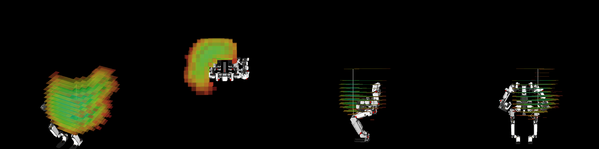

# jsk_ik_server

## IK reachability map

### How to use

```bash
roscd jsk_ik_server
cd scripts/ik-grid
# bash <robot name>.sh
bash pr2.sh
```
### PR2 IK Evaluation

#### X-up IK reachability with `:rotation-axis :z`


#### Y-up IK reachability with `:rotation-axis :z`


#### Z-up IK reachability with `:rotation-axis :z`


### Jaxon IK Evaluation

For more detailed infomation. please read [docs/jaxon_ik_evaluation](docs/jaxon_ik_evaluation.md)

#### X-up IK reachability with `:rotation-axis :z`


#### Y-up IK reachability with `:rotation-axis :z`


#### Z-up IK reachability with `:rotation-axis :z`


### TABLIS IK Evaluation

#### X-up IK reachability with `:rotation-axis :z`




#### Y-up IK reachability with `:rotation-axis :z`


#### Z-up IK reachability with `:rotation-axis :z`


### Fetch IK Evaluation

#### X-up IK reachability with `:rotation-axis :z`


#### Y-up IK reachability with `:rotation-axis :z`


#### Z-up IK reachability with `:rotation-axis :z`


### Baxter IK Evaluation

#### X-up IK reachability with `:rotation-axis :z`


#### Y-up IK reachability with `:rotation-axis :z`


#### Z-up IK reachability with `:rotation-axis :z`


